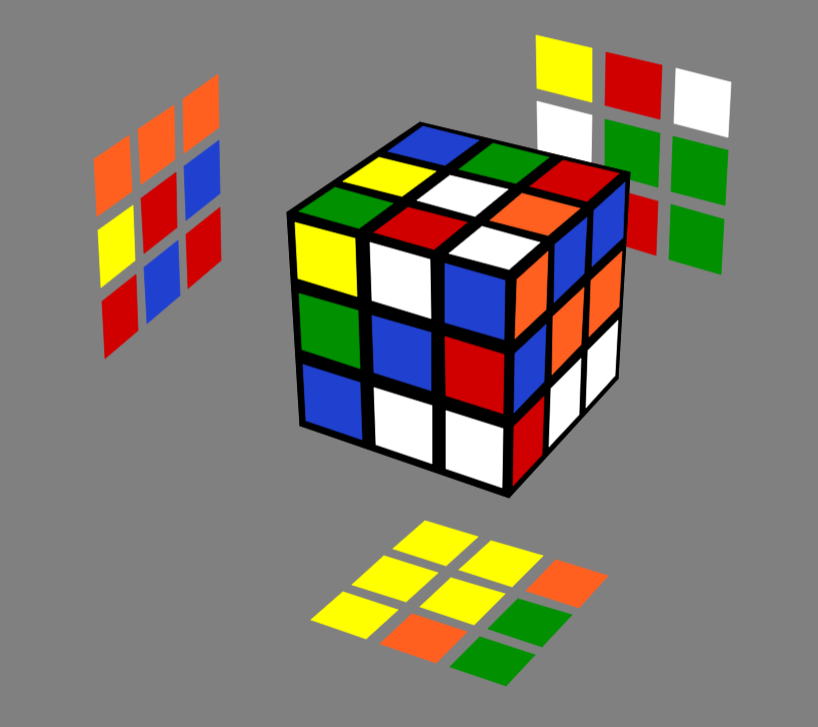
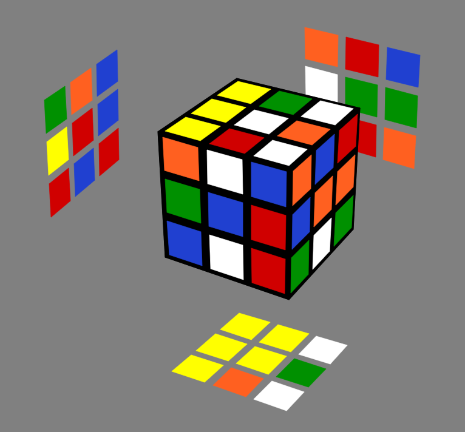
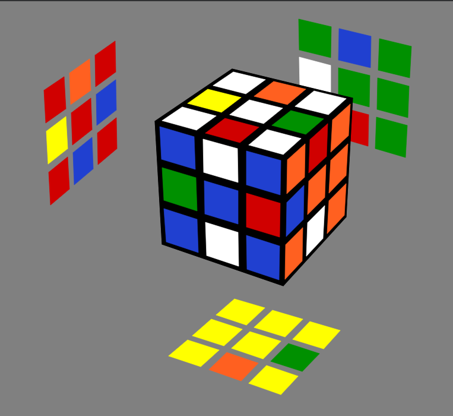
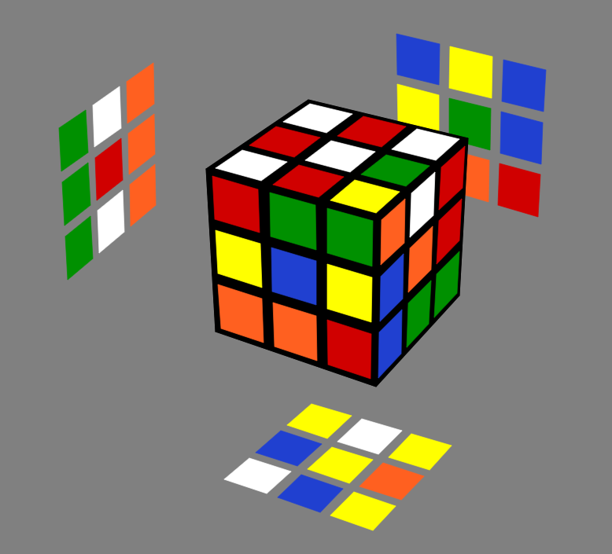

# cerb
Cerb is a C++ implementation of a simple algorithm to solve a 3x3x3 Rubik's Cube.
## Don't get your hopes up
In contrast to the conventional approaches like the Beginner's method, Roux method, ZZ and Fridrich method which are targeted towards minimizing the total number of moves required to solve the cube, Cerb solves the cube piece by piece. Since there are eight corner pieces and twelve edge pieces in a 3x3x3 Rubik's Cube, it would take a little more than twenty iterations to get all of them to their respective positions. Further, the separation of orientation and permutation of corner peices adds to the verbosity of the solution. The average number of quarter moves required for a full solve is roughly about 500-600, which corresponds to atleast two-three minutes. So we're certainly not making the Guinness book, least of all in the minimum-moves category!


## Usage
The program takes in the scrambled cube configuration in two different text files - one for the corner pieces and the other one for edge pieces. Follow the below lettering scheme to format your cube configuration files. If the cube is traced using the lettering schemes given below from position `a` to position `x`, the edge and corner config files will look like this

`colAt(a) colAt(b) colAt(c) ... colAt(x)`

where `colAt(#)` represents the the color at position `#`.
<table>
  <thead><th>Lettering Scheme for Corners</th><th>Lettering Scheme for Edges</th></thead> 
  <tr><td></td><td></td></tr>
</table>

In the `main.cpp`, invoke the `Cube::solve(EDGE_CONFIG_FILE_PATH, CORNER_CONFIG_FILE_PATH)` function and compile the project into a neat little executable.


## Compilation
The entire project is divided into three class files, so compiling the program ought to be simple enough. A Makefile is provided in the root directory of the project which simplies the compilation and linking process. 
#### Manual Compilation
If `make` is not installed, then the project can be manually compiled with the `g++` compiler

```shell 
g++ -c main.cpp headers/Cube.cpp headers/Edges.cpp headers/Corners.cpp
```

This compiles the source files into object files which can then be linked into an executable `cerb`

```shell
g++ main.o Cube.o Edges.o Corners.o -o cerb
```

Finally, to generate the solution to cube configuration in the `test_cubes/edges.txt` and `test_cubes/corners.txt`, just execute the assembler output file `./cerb` 
## Tests
These tests were performed with the help of the <a href="https://github.com/cubing/AnimCubeJS">AnimCubeJs</a> simulator.

### Test (I)
<table>
  <thead><th>Stage</th><th>Cube State</th><th>Move Sequence</th></thead>
  <tr><td>Scrambled Cube</td><td></td><td><b>B2 D U2 L R2 B' U' R U R' U2 R' D2 R2 U D B' F' U' R2 D' B' F2 D B</b></td></tr>
  <tr><td>Corners Oriented</td><td></td><td><b>L2 D' L2 D F2 U' F U L2 U L2 U' F R2 D' F L2 D' L2 D F2 U' F U L2 U L2 U' F F' D R2 F2 L2 D' L2 D F2 U' F U L2 U L2 U' F F2 D' F2 L2 D' L2 D F2 U' F U L2 U L2 U' F F2 D</b></td></tr>
  <tr><td>Corners Solved</td><td></td><td><b>L D F' F' U B' U2 F U' F' U2 F B U' F D' L' D2 F2 F' U B' U2 F U' F' U2 F B U' F2 D2 L2 F2 F' U B' U2 F U' F' U2 F B U' F2 L2 D' F2 F' U B' U2 F U' F' U2 F B U' F2 D L2 F2 F' U B' U2 F U' F' U2 F B U' F2 L2</b></td></tr>
  <tr><td>Edges Solved</td><td></td><td><b>F' U B' U2 F U' F' U2 F B U' E' L D M2 F' U B' U2 F U' F' U2 F B U' M2 D' L' E L D M2 F' U B' U2 F U' F' U2 F B U' M2 D' L' M F' U B' U2 F U' F' U2 F B U' M' D' M F' U B' U2 F U' F' U2 F B U' M' D D2 M F' U B' U2 F U' F' U2 F B U' M' D2 M D2 M F' U B' U2 F U' F' U2 F B U' M' D2 M' L2 D' M F' U B' U2 F U' F' U2 F B U' M' D L2 D M F' U B' U2 F U' F' U2 F B U' M' D' F' U B' U2 F U' F' U2 F B U' L' D M2 F' U B' U2 F U' F' U2 F B U' M2 D' L M D2 M F' U B' U2 F U' F' U2 F B U' M' D2 M'</b></td></tr>
</table>

### Test (II)
<table>
  <thead><th>Stage</th><th>Cube State</th><th>Move Sequence</th></thead>
  <tr><td>Scrambled Cube</td><td></td><td><b>U F2 B2 U F L' U' F2 L' R2 D L' F2 U' D2 B2 F R' D' B' D2 L' D2 L2 D</b></td></tr>
  <tr><td>Corners Oriented</td><td></td><td><b>R' D' F L2 D' L2 D F2 U' F U L2 U L2 U' F F' D R R2 D' F F' U L2 U' L2 U' F' U F2 D' L2 D L2 F' D R2 D F2 L2 D' L2 D F2 U' F U L2 U L2 U' F F2 D' F2 F' U L2 U' L2 U' F' U F2 D' L2 D L2 F2 D' F2 F' U L2 U' L2 U' F' U F2 D' L2 D L2 F2 D</b></td></tr>
  <tr><td>Corners Solved</td><td></td><td><b>L D F' F' U B' U2 F U' F' U2 F B U' F D' L' L2 F2 F' U B' U2 F U' F' U2 F B U' F2 L2 F' U B' U2 F U' F' U2 F B U' D2 F2 F' U B' U2 F U' F' U2 F B U' F2 D2 D F2 F' U B' U2 F U' F' U2 F B U' F2 D' D' F2 F' U B' U2 F U' F' U2 F B U' F2 D F2 F' U B' U2 F U' F' U2 F B U' F2
</b></td></tr>
  <tr><td>Edges Solved</td><td></td><td><b>F' U B' U2 F U' F' U2 F B U' M2 D2 M F' U B' U2 F U' F' U2 F B U' M' D2 M2 D M2 F' U B' U2 F U' F' U2 F B U' M2 D' M' F' U B' U2 F U' F' U2 F B U' M L' D M2 F' U B' U2 F U' F' U2 F B U' M2 D' L D' M2 F' U B' U2 F U' F' U2 F B U' M2 D E2 L D' M F' U B' U2 F U' F' U2 F B U' M' D L' E2 L D' M F' U B' U2 F U' F' U2 F B U' M' D L' M F' U B' U2 F U' F' U2 F B U' M' L2 D M2 F' U B' U2 F U' F' U2 F B U' M2 D' L2 L2 D' M F' U B' U2 F U' F' U2 F B U' M' D L2 E' L D' M F' U B' U2 F U' F' U2 F B U' M' D L' E M2 F' U B' U2 F U' F' U2 F B U' M2 E' L D' M F' U B' U2 F U' F' U2 F B U' M' D L' E'</b></td></tr>
</table>

### Test (III)
<table>
  <thead><th>Stage</th><th>Cube State</th><th>Move Sequence</th></thead>
  <tr><td>Scrambled Cube</td><td></td><td><b>B2 R2 D2 R2 L' U' B' U2 F L U L' D L' F2 D' U L' F' D' R U2 B2 D2 B2</b></td></tr>
  <tr><td>Corners Oriented</td><td></td><td><b>R' D' F F' U L2 U' L2 U' F' U F2 D' L2 D L2 F' D R D F2 F' U L2 U' L2 U' F' U F2 D' L2 D L2 F2 D' D' F2 F' U L2 U' L2 U' F' U F2 D' L2 D L2 F2 D </b></td></tr>
  <tr><td>Corners Solved</td><td></td><td><b>D' F2 F' U B' U2 F U' F' U2 F B U' F2 D L2 F2 F' U B' U2 F U' F' U2 F B U' F2 L2 L D F' F' U B' U2 F U' F' U2 F B U' F D' L' D2 F2 F' U B' U2 F U' F' U2 F B U' F2 D2 D F2 F' U B' U2 F U' F' U2 F B U' F2 D' F' U B' U2 F U' F' U2 F B U' F2 F' U B' U2 F U' F' U2 F B U' F2 </b></td></tr>
  <tr><td>Edges Solved</td><td></td><td><b>F' U B' U2 F U' F' U2 F B U' L2 D M2 F' U B' U2 F U' F' U2 F B U' M2 D' L2 E' L D' M F' U B' U2 F U' F' U2 F B U' M' D L' E M D2 M F' U B' U2 F U' F' U2 F B U' M' D2 M' M2 D2 M F' U B' U2 F U' F' U2 F B U' M' D2 M2 D M F' U B' U2 F U' F' U2 F B U' M' D' D2 M2 F' U B' U2 F U' F' U2 F B U' M2 D2 M D2 M F' U B' U2 F U' F' U2 F B U' M' D2 M' L D' M F' U B' U2 F U' F' U2 F B U' M' D L' L D M2 F' U B' U2 F U' F' U2 F B U' M2 D' L' E2 L D' M F' U B' U2 F U' F' U2 F B U' M' D L' E2 M2 F' U B' U2 F U' F' U2 F B U' M2 L' D M2 F' U B' U2 F U' F' U2 F B U' M2 D' L E L' D' M F' U B' U2 F U' F' U2 F B U' M' D L E' D' M F' U B' U2 F U' F' U2 F B U' M' D D M2 F' U B' U2 F U' F' U2 F B U' M2 D'</b></td></tr>
</table>

### Test (IV)
<table>
  <thead><th>Stage</th><th>Cube State</th><th>Move Sequence</th></thead>
  <tr><td>Scrambled Cube</td><td></td><td><b>L2 F' R' D2 R B' F D' R D' L' D R D2 F R U' R2 F2 D' B2 F' L2 B L2</b></td></tr>
  <tr><td>Corners Oriented</td><td></td><td><b>R2 D' F F' U L2 U' L2 U' F' U F2 D' L2 D L2 F' D R2 D F2 L2 D' L2 D F2 U' F U L2 U L2 U' F F2 D' F2 L2 D' L2 D F2 U' F U L2 U L2 U' F F2 D' F2 L2 D' L2 D F2 U' F U L2 U L2 U' F F2 D D2 F2 F' U L2 U' L2 U' F' U F2 D' L2 D L2 F2 D2 </b></td></tr>
  <tr><td>Corners Solved</td><td></td><td><b>D2 F2 F' U B' U2 F U' F' U2 F B U' F2 D2 D F2 F' U B' U2 F U' F' U2 F B U' F2 D' D' F2 F' U B' U2 F U' F' U2 F B U' F2 D L2 F2 F' U B' U2 F U' F' U2 F B U' F2 L2 F2 F' U B' U2 F U' F' U2 F B U' F2 
</b></td></tr>
  <tr><td>Edges Solved</td><td></td><td><b>F' U B' U2 F U' F' U2 F B U' E' L D' M F' U B' U2 F U' F' U2 F B U' M' D L' E D' M2 F' U B' U2 F U' F' U2 F B U' M2 D L' D M2 F' U B' U2 F U' F' U2 F B U' M2 D' L L2 D' M F' U B' U2 F U' F' U2 F B U' M' D L2 L D M2 F' U B' U2 F U' F' U2 F B U' M2 D' L' M D2 M F' U B' U2 F U' F' U2 F B U' M' D2 M' D2 M F' U B' U2 F U' F' U2 F B U' M' D2 E2 L D' M F' U B' U2 F U' F' U2 F B U' M' D L' E2 M' F' U B' U2 F U' F' U2 F B U' M F' U B' U2 F U' F' U2 F B U' D' M F' U B' U2 F U' F' U2 F B U' M' D D2 M2 F' U B' U2 F U' F' U2 F B U' M2 D2 F' U B' U2 F U' F' U2 F B U' 
</b></td></tr>
</table>
